## Hi, I'm Matthew Usuquen

I am a Fullstack Software Engineer, currently working at Amazon Web Services since 2024, building production apps in TypeScript, React, Node.js, and PostgreSQL, with hands-on LLM API (Anthropic, OpenAI, LangGraph, LangChain) integration. Shipped four full-stack apps across edtech, dev tooling, and AI personalization. 

## Tech Stack

## Contributions

## 3x AWS certified

- Machine Learning Specialty
- Solutions Architect Associate
- Certified Cloud Practitioner
